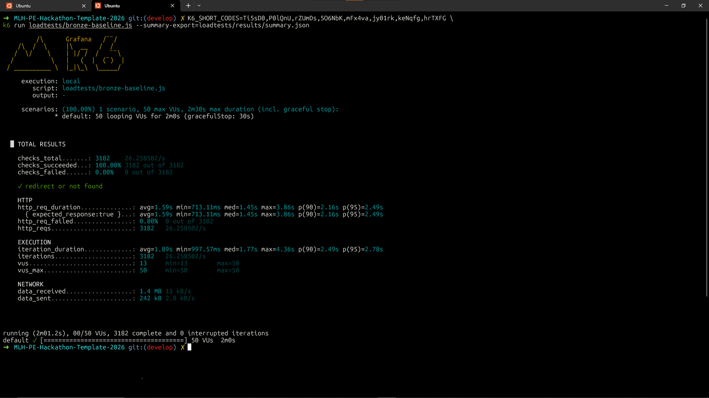
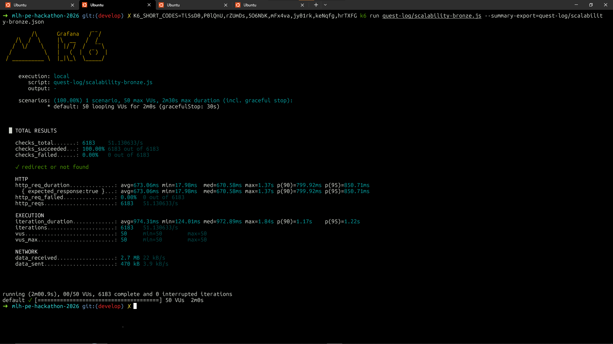

# Scalability Bronze

Simulate **50 virtual users** for **2 minutes** hitting `GET /<short_code>`. Redirects are **not** followed, so k6 does not request external URLs.

## Requirements

- [k6](https://k6.io/docs/get-started/installation/) installed locally.

## How to run

From the **repository root**:

```bash
# Terminal 1 — API
uv run run.py
```

```bash
# Terminal 2
k6 run quest-log/scalability-bronze.js
```

| Env | Default | Notes |
|-----|---------|--------|
| `BASE_URL` | `http://127.0.0.1:5000` | No trailing slash. If the API is on a droplet behind Compose + Nginx, use `http://YOUR_PUBLIC_IP:8080` and open port **8080** ([README](../README.md#local-vs-deployed-digitalocean-vm)). |
| `K6_SHORT_CODES` | *(empty)* | Comma-separated codes; when set, `K6_SEEDED_FRACTION` applies. |
| `K6_SEEDED_FRACTION` | `0.5` | Share of iterations using listed codes (`0` = all random, `1` = only listed). |

**Why `K6_SHORT_CODES`?** You can omit it: every request uses a random 6-character code, so most responses are **404** — that still load-tests `GET /<short_code>` and the DB lookup. Setting `K6_SHORT_CODES` adds **real codes from your database** (e.g. from MLH seed `urls.csv`) so part of the traffic gets **302** (active URL) or **404** (missing/inactive), which better matches production-style mix and makes runs reproducible when you document which codes you used.

## Where we run k6

**From here on, we run Bronze (and related) load tests on a VM** so results are not dominated by a low-spec machine. The machine used for the rerun below is a **DigitalOcean droplet: 4 GB RAM, 2 vCPUs**.

**Remote API:** Point `BASE_URL` at the public URL (e.g. `http://<droplet-ip>:8080` for this repo’s Compose Nginx mapping). The VM should run **`docker compose up -d --build`** if you want the stack to stay up after SSH disconnect.

## Results from our run

### Original run (local)

Command:

```bash
K6_SHORT_CODES=Ti5sD0,P0lQnU,rZUmDs,5O6NbK,mFx4va,jy01rk,keNqfg,hrTXFG \
k6 run quest-log/scalability-bronze.js
```



| | |
|--|--|
| Peak VUs (`vus_max`) | 50 |
| Response time — average (`http_req_duration` avg) | ~1591 ms |
| Response time — p95 (`http_req_duration`) | ~2495 ms (~2.50 s) |
| Error rate (`http_req_failed`) | 0% |

### Rerun (VM — DigitalOcean 4 GB / 2 vCPU)

Command (summary written to repo root as `scalability-bronze.json`):

```bash
K6_SHORT_CODES=Ti5sD0,P0lQnU,rZUmDs,5O6NbK,mFx4va,jy01rk,keNqfg,hrTXFG k6 run quest-log/scalability-bronze.js --summary-export quest-log/scalability-bronze.json
```



| | |
|--|--|
| Peak VUs (`vus_max`) | 50 |
| Response time — average (`http_req_duration` avg) | ~673 ms |
| Response time — p95 (`http_req_duration`) | ~851 ms (~0.85 s) |
| Error rate (`http_req_failed`) | 0% |
