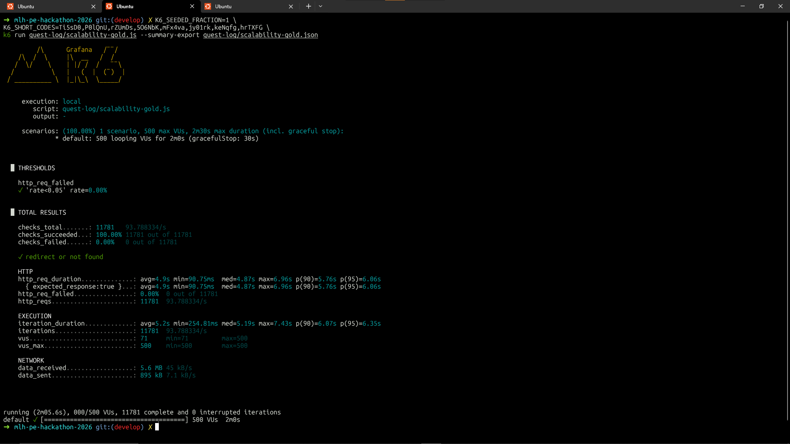
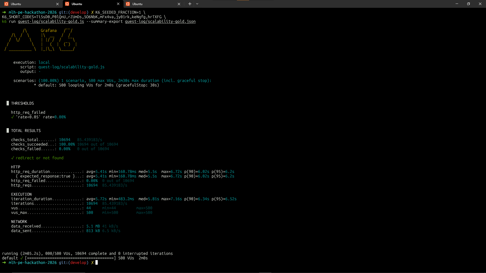
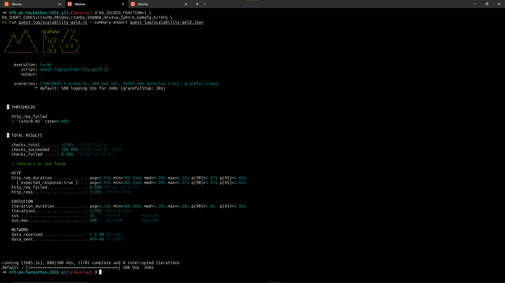

# Scalability Gold

**500** virtual users for **2 minutes** against `GET /<short_code>` through **Nginx** (redirects not followed). Tier asks for **500+ concurrent users** *or* **≥100 req/s**, **Redis** caching for hot reads, and **error rate under 5%** during the tsunami. The k6 script enforces **`http_req_failed` &lt; 5%** with a threshold (runs that breach it exit non-zero).

## Requirements

- [k6](https://k6.io/docs/get-started/installation/)
- [Docker](https://docs.docker.com/get-docker/) with Compose (Nginx, **2+** app containers, **Postgres**, **Redis**)
- Seed data loaded (same as [scalability-silver.md](scalability-silver.md))

## How to run

From the **repository root**:

```bash
cp secrets/postgres_password.txt.example secrets/postgres_password.txt
```

```bash
# Foreground (logs) — local debugging
docker compose up --build

# Detached — on a VM so the stack keeps running after you disconnect SSH
docker compose up -d --build
```

Load the seed CSVs into Postgres so real short codes exist (`.env` pointing at **`127.0.0.1:5432`** with the **same password** as `secrets/postgres_password.txt`):

```bash
uv run python scripts/load_seed_csv.py
```

```bash
K6_SEEDED_FRACTION=1 \
K6_SHORT_CODES=Ti5sD0,P0lQnU,rZUmDs,5O6NbK,mFx4va,jy01rk,keNqfg,hrTXFG \
k6 run quest-log/scalability-gold.js
```

Optional — save the end-of-run summary to JSON (same idea as [scalability-bronze.md](scalability-bronze.md)):

```bash
K6_SEEDED_FRACTION=1 \
K6_SHORT_CODES=Ti5sD0,P0lQnU,rZUmDs,5O6NbK,mFx4va,jy01rk,keNqfg,hrTXFG \
k6 run quest-log/scalability-gold.js --summary-export quest-log/scalability-gold.json
```

| Env | Default | Notes |
|-----|---------|--------|
| `BASE_URL` | `http://127.0.0.1:8080` | Nginx; no trailing slash. On a droplet, use `http://YOUR_PUBLIC_IP:8080` and open **TCP 8080** in the cloud firewall (see [README](../README.md#local-vs-deployed-digitalocean-vm)). |
| `K6_SHORT_CODES` | *(empty)* | Comma-separated codes — see [scalability-bronze.md](scalability-bronze.md). |
| `K6_SEEDED_FRACTION` | `0.5` in shared script | For Gold we use **`1`** with `K6_SHORT_CODES` set — see below. |

**Why `K6_SEEDED_FRACTION=1`?** With the script default (**0.5**), many iterations use **random** short codes. Those almost always return **404**, and this app **does not cache** 404 responses—so that traffic keeps hitting the **database** and never warms **Redis** for redirects. Gold is meant to show **caching of hot reads**; we therefore set **`K6_SEEDED_FRACTION=1`** so **every** iteration picks from **`K6_SHORT_CODES`** (real seeded URLs). That drives the **302** redirect path where **`X-Cache`** can go **MISS** then **HIT**, and load reflects **shared cache + DB** behavior instead of mostly uncached 404 lookups.

**Caching check:** `curl -sD - -o /dev/null "http://127.0.0.1:8080/Ti5sD0"` — expect **`X-Cache: MISS`** on the first request for a code, then **`X-Cache: HIT`** on the next (with Redis and Compose as configured). Replace `Ti5sD0` with any seeded short code.

## Where we run k6

Same setup as our **Scalability Silver** reruns: **Docker Compose** and **k6** on a **DigitalOcean droplet (4 GB RAM, 2 vCPUs)**.

**Remote droplet:** Run Compose with **`docker compose up -d --build`** on the VM. Hit the API at **`http://<droplet-public-ip>:8080`** from a browser or from k6 on your laptop via `BASE_URL` (Compose publishes Nginx on host port **8080**). Run k6 on the VM with `BASE_URL=http://127.0.0.1:8080` if you prefer.

## Results from our run

### Caching evidence (`X-Cache` headers)

Two `curl` requests to the same active short code through Nginx: the **first** response shows **`X-Cache: MISS`** (lookup + populate cache); the **second** shows **`X-Cache: HIT`** (served from Redis).


### Nginx — `worker_connections` exhausted (baseline)

Under the **500 VU** load, the Nginx container logged repeated **`512 worker_connections are not enough`** alerts alongside mixed **302** / **404** access lines. That indicates the **default per-worker connection cap** was too low for concurrent clients (k6 user agent), so the edge proxy became a bottleneck before we raised limits.


### First Gold k6 run

Default **`K6_SEEDED_FRACTION`** (**0.5**); mixed seeded and random short codes.

```bash
K6_SHORT_CODES=Ti5sD0,P0lQnU,rZUmDs,5O6NbK,mFx4va,jy01rk,keNqfg,hrTXFG \
k6 run quest-log/scalability-gold.js
```


| | |
|--|--|
| Peak VUs (`vus_max`) | 500 |
| Response time — average (`http_req_duration` avg) | ~435 ms |
| Response time — p95 (`http_req_duration`) | ~4531 ms (~4.53 s) |
| Error rate (`http_req_failed`) | ~92% |

### Second Gold k6 run

```bash
K6_SEEDED_FRACTION=1 \
K6_SHORT_CODES=Ti5sD0,P0lQnU,rZUmDs,5O6NbK,mFx4va,jy01rk,keNqfg,hrTXFG \
k6 run quest-log/scalability-gold.js
```



| | |
|--|--|
| Peak VUs (`vus_max`) | 500 |
| Response time — average (`http_req_duration` avg) | ~4906 ms (~4.91 s) |
| Response time — p95 (`http_req_duration`) | ~6061 ms (~6.06 s) |
| Error rate (`http_req_failed`) | 0% |

### Third Gold k6 run

Same k6 command as the second run. **Gunicorn** **`--workers`** increased from **2** to **4** in `docker/entrypoint.sh` (rebuild Compose before running).

```bash
K6_SEEDED_FRACTION=1 \
K6_SHORT_CODES=Ti5sD0,P0lQnU,rZUmDs,5O6NbK,mFx4va,jy01rk,keNqfg,hrTXFG \
k6 run quest-log/scalability-gold.js
```



| | |
|--|--|
| Peak VUs (`vus_max`) | 500 |
| Response time — average (`http_req_duration` avg) | ~5418 ms (~5.42 s) |
| Response time — p95 (`http_req_duration`) | ~6202 ms (~6.20 s) |
| Error rate (`http_req_failed`) | 0% |

### Fourth Gold k6 run

Same k6 command as the second and third runs. **Gunicorn** **`--workers`** increased from **4** to **8** in `docker/entrypoint.sh` (rebuild Compose before running).

```bash
K6_SEEDED_FRACTION=1 \
K6_SHORT_CODES=Ti5sD0,P0lQnU,rZUmDs,5O6NbK,mFx4va,jy01rk,keNqfg,hrTXFG \
k6 run quest-log/scalability-gold.js
```


| | |
|--|--|
| Peak VUs (`vus_max`) | 500 |
| Response time — average (`http_req_duration` avg) | ~5293 ms (~5.29 s) |
| Response time — p95 (`http_req_duration`) | ~6200 ms (~6.20 s) |
| Error rate (`http_req_failed`) | 0% |

### Fifth Gold k6 run

Same k6 command as above. **Horizontal scale:** **`server-3`** and **`server-4`** added in `compose.yaml` (four app containers total); **`nginx.conf`** upstream lists all four backends. **Gunicorn** still **`--workers 8`** per container. Rebuild Compose before running.

```bash
K6_SEEDED_FRACTION=1 \
K6_SHORT_CODES=Ti5sD0,P0lQnU,rZUmDs,5O6NbK,mFx4va,jy01rk,keNqfg,hrTXFG \
k6 run quest-log/scalability-gold.js
```



| | |
|--|--|
| Peak VUs (`vus_max`) | 500 |
| Response time — average (`http_req_duration` avg) | ~4930 ms (~4.93 s) |
| Response time — p95 (`http_req_duration`) | ~5618 ms (~5.62 s) |
| Error rate (`http_req_failed`) | 0% |

## Bottleneck report

The first tsunami run failed mostly at the **edge**: Nginx’s default **512** `worker_connections` was exhausted under **500** k6 VUs, which showed up as **`worker_connections are not enough`** in logs and **~92%** `http_req_failed`.

We **raised `worker_connections` to 4096**, added **Redis** so repeat requests to `GET /<short_code>` could skip Postgres (`X-Cache` MISS then HIT), steered k6 with **`K6_SEEDED_FRACTION=1`** so load exercised that redirect path, and increased **Gunicorn** workers (**2 → 8**) plus **horizontal scale** (**two → four** app containers behind Nginx).

The **fifth** k6 capture stayed at **0%** errors (under the **5%** bar) with **~93 req/s** and **lower** average and **p95** latency than the **two-container, eight-worker** run—matching what we expected after removing the connection ceiling and adding cache and capacity.
