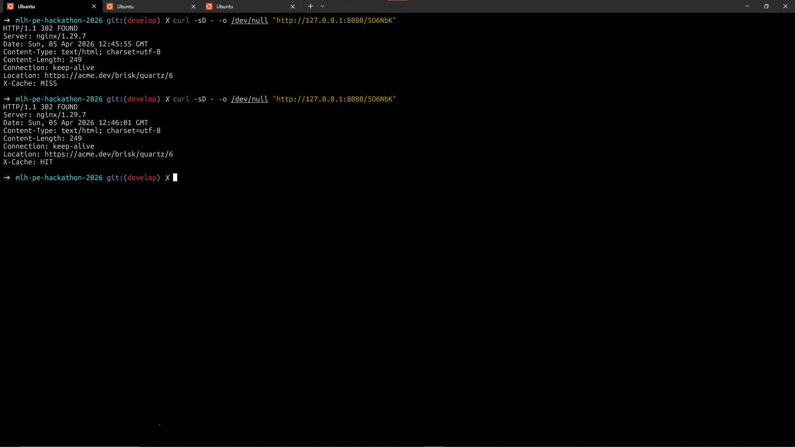
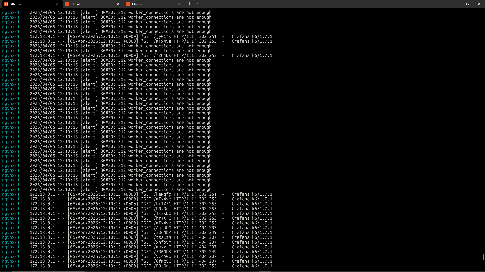
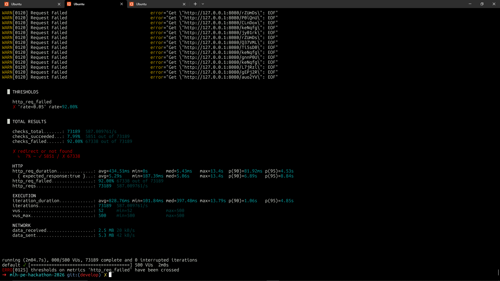

# Scalability Gold

**500** virtual users for **2 minutes** against **`GET /<short_code>`** through **Nginx** (redirects not followed). Tier asks for **500+ concurrent users** *or* **≥100 req/s**, **Redis** caching for hot reads, and **error rate under 5%** during the tsunami. The k6 script enforces **`http_req_failed` &lt; 5%** with a threshold (runs that breach it exit non-zero).

## Requirements

- [k6](https://k6.io/docs/get-started/installation/)
- [Docker](https://docs.docker.com/get-docker/) with Compose (Nginx, **2+** app containers, **Postgres**, **Redis**)
- Seed data loaded (same as [scalability-silver.md](scalability-silver.md))

## How to run

From the **repository root**:

```bash
cp secrets/postgres_password.txt.example secrets/postgres_password.txt
```

```bash
docker compose up --build
```

Load the seed CSVs into Postgres so real short codes exist (`.env` pointing at **`127.0.0.1:5432`** with the **same password** as `secrets/postgres_password.txt`):

```bash
uv run python scripts/load_seed_csv.py
```

```bash
K6_SHORT_CODES=Ti5sD0,P0lQnU,rZUmDs,5O6NbK,mFx4va,jy01rk,keNqfg,hrTXFG \
k6 run quest-log/scalability-gold.js
```

| Env | Default | Notes |
|-----|---------|--------|
| `BASE_URL` | `http://127.0.0.1:8080` | Nginx; no trailing slash. |
| `K6_SHORT_CODES` | *(empty)* | Comma-separated codes; with `K6_SEEDED_FRACTION` — see [scalability-bronze.md](scalability-bronze.md). |
| `K6_SEEDED_FRACTION` | `0.5` | Share of iterations using listed codes. |

**Caching check:** `curl -sD - -o /dev/null "http://127.0.0.1:8080/<short_code>"` — expect **`X-Cache: MISS`** on the first request for a code, then **`X-Cache: HIT`** on the next (with Redis and Compose as configured).

## Where we run k6

Same setup as our **Scalability Silver** reruns: **Docker Compose** and **k6** on a **DigitalOcean droplet (4 GB RAM, 2 vCPUs)**.

## Results from our run

### Caching evidence (`X-Cache` headers)

Two `curl` requests to the same active short code through Nginx: the **first** response shows **`X-Cache: MISS`** (lookup + populate cache); the **second** shows **`X-Cache: HIT`** (served from Redis).



### Nginx — `worker_connections` exhausted (baseline)

Under the **500 VU** load, the Nginx container logged repeated **`512 worker_connections are not enough`** alerts alongside mixed **302** / **404** access lines. That indicates the **default per-worker connection cap** was too low for concurrent clients (k6 user agent), so the edge proxy became a bottleneck before we raised limits.



### First Gold k6 run (500 VUs, 2 minutes)

```bash
K6_SHORT_CODES=Ti5sD0,P0lQnU,rZUmDs,5O6NbK,mFx4va,jy01rk,keNqfg,hrTXFG \
k6 run quest-log/scalability-gold.js
```



| | |
|--|--|
| Peak VUs (`vus_max`) | 500 |
| Response time — average (`http_req_duration` avg) | ~435 ms |
| Response time — p95 (`http_req_duration`) | ~4531 ms (~4.53 s) |
| Error rate (`http_req_failed`) | ~92% |
