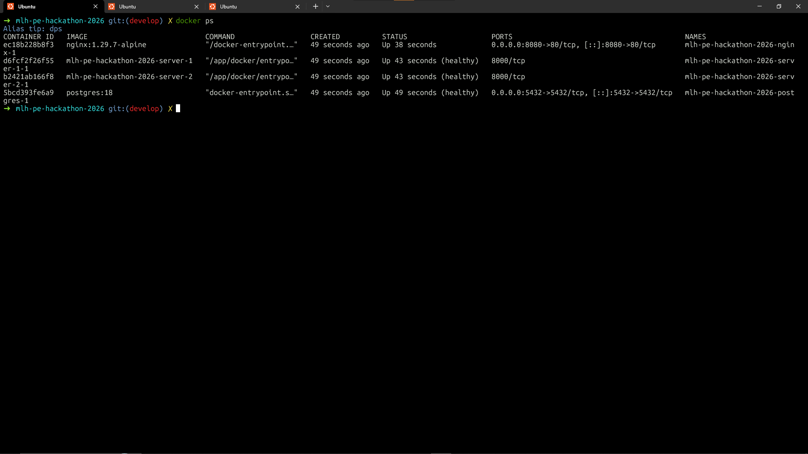
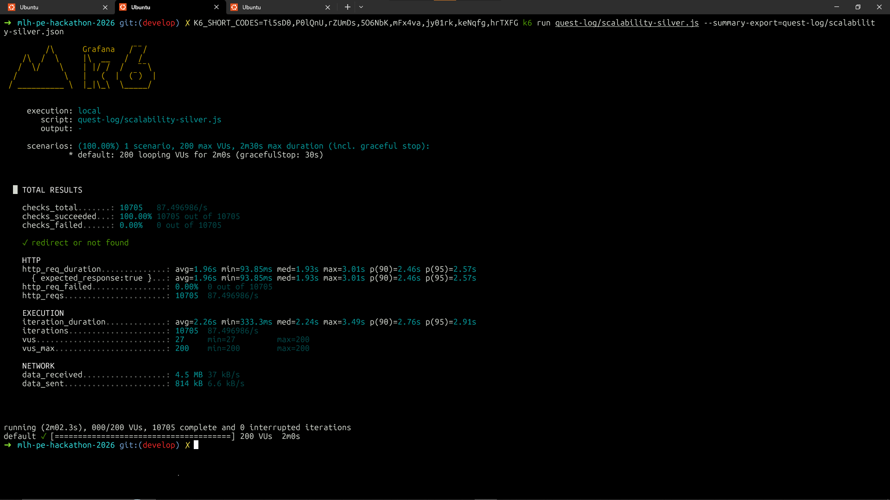

# Scalability Silver

**200** virtual users for **2 minutes** against **`GET /<short_code>`** through **Nginx** (redirects not followed). Tier asks for **at least two** app containers behind Nginx and **`http_req_duration` p(95)** under **3 s**.

## Requirements

- [k6](https://k6.io/docs/get-started/installation/)
- [Docker](https://docs.docker.com/get-docker/) with Compose

## How to run

From the **repository root**:

```bash
cp secrets/postgres_password.txt.example secrets/postgres_password.txt
```

```bash
# Foreground (logs) — local debugging
docker compose up --build

# Detached — on a VM so the stack keeps running after you disconnect SSH
docker compose up -d --build
```

**Note:** Load the seed CSVs into Postgres so real short codes exist and k6 can see a mix of **302** and **404** (same setup used for the runs below). With Compose up:

```bash
docker compose exec server-1 uv run python scripts/load_seed_csv.py
```

Requires `data/users.csv`, `data/urls.csv`, and `data/events.csv` (from the hackathon platform).

```bash
K6_SHORT_CODES=Ti5sD0,P0lQnU,rZUmDs,5O6NbK,mFx4va,jy01rk,keNqfg,hrTXFG \
k6 run quest-log/scalability-silver.js
```

| Env | Default | Notes |
|-----|---------|--------|
| `BASE_URL` | `http://127.0.0.1:8080` | Nginx; no trailing slash. Against a droplet: `http://YOUR_PUBLIC_IP:8080` with firewall **8080** open ([README](../README.md#local-vs-deployed-digitalocean-vm)). |
| `K6_SHORT_CODES` | *(empty)* | Comma-separated codes; when set, `K6_SEEDED_FRACTION` applies — see [scalability-bronze.md](scalability-bronze.md). |
| `K6_SEEDED_FRACTION` | `0.5` | Share of iterations using listed codes. |

## Where we run k6

First capture below was on a **low-spec machine**; the rerun was on a **DigitalOcean droplet: 4 GB RAM, 2 vCPUs** (k6 and Docker on that host).

**Remote droplet:** Use **`docker compose up -d --build`** on the server. Test from outside with **`http://<public-ip>:8080`** or set that as `BASE_URL` when running k6 from your laptop.

## Results from our run

### Past run (local)

No screenshot for this run.

```bash
K6_SHORT_CODES=Ti5sD0,P0lQnU,rZUmDs,5O6NbK,mFx4va,jy01rk,keNqfg,hrTXFG \
k6 run quest-log/scalability-silver.js
```

| | |
|--|--|
| Peak VUs (`vus_max`) | 200 |
| Response time — average (`http_req_duration` avg) | ~7941 ms |
| Response time — p95 (`http_req_duration`) | ~26.6 s |
| Error rate (`http_req_failed`) | 0% |

### Rerun (VM — DigitalOcean 4 GB / 2 vCPU)



```bash
K6_SHORT_CODES=Ti5sD0,P0lQnU,rZUmDs,5O6NbK,mFx4va,jy01rk,keNqfg,hrTXFG \
k6 run quest-log/scalability-silver.js
```



| | |
|--|--|
| Peak VUs (`vus_max`) | 200 |
| Response time — average (`http_req_duration` avg) | ~1962 ms |
| Response time — p95 (`http_req_duration`) | ~2573 ms (~2.57 s) |
| Error rate (`http_req_failed`) | 0% |
